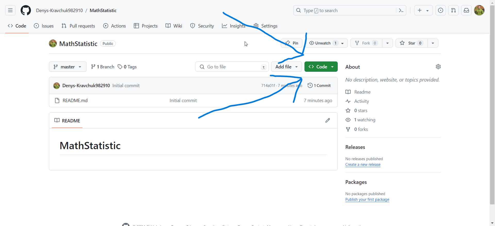
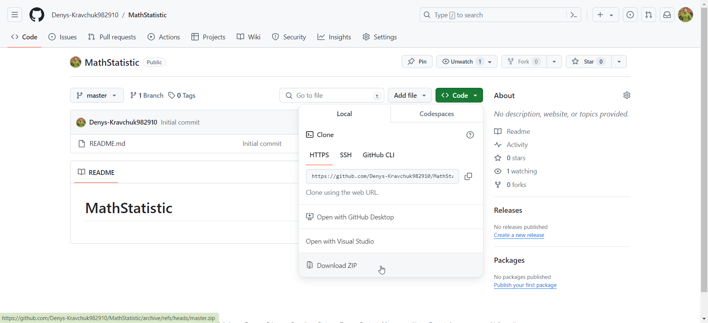

# MathStatistic

Для того, щоб скачати файли програми потрібно:

1. Натиснути Code -> Скачати ZIP

Перший крок

Другий крок

Після скачування проекту:
1. Потрібно перейти у папку StatisticSoftware та натиснути на файл StatisticSoftware.sln (Має бути встановлена Visual Studio 2022)
2. Для відкриття графіків потрібно перейти у папку graphics, відкрити у будь-якому редакторі та запустити через командний рядок
(У папці graphics відкрити командний рядок та ввести почергово команди: npm i та після виконання npm start)
